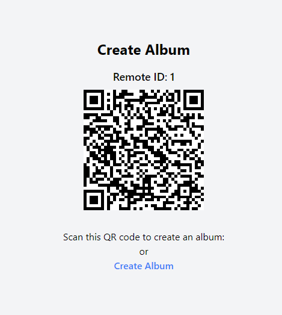

## Photographer-Entry

This is a static site that display a QR code and a text link.

It serve as an entry point for user to register in the app.

Once a remote has been used it cannot be used again, unless the remote is detached from the album. (This means that the album is in "longterm" status)

If a user tries to scan the QR code after its been used, they will be redirected to a Remote-in-use page.